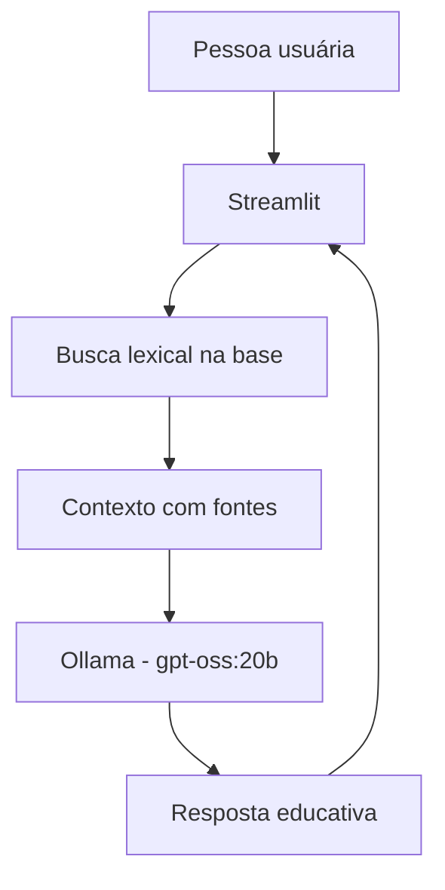

# 🥗 NutriBússola

Agente educativo de nutrição que ajuda a entender conceitos básicos e construir bons hábitos alimentares a partir de uma base de conhecimento local.

Este projeto foi adaptado do modelo [falvojr/dio-lab-bia-do-futuro](https://github.com/falvojr/dio-lab-bia-do-futuro) para o Lab da DIO **Construa seu Assistente Virtual com Inteligência Artificial**. A interface usa Streamlit, o modelo roda localmente pelo Ollama e os PDFs de nutrição são transformados em trechos pesquisáveis antes de cada resposta.

## O que o agente faz

- Explica fundamentos de alimentação, macronutrientes, micronutrientes, hidratação e leitura de rótulos.
- Usa os trechos mais relevantes da base local como contexto para o modelo.
- Mostra as fontes recuperadas na interface.
- Assume quando não encontra informação suficiente.
- Mantém limites de segurança: não diagnostica, não interpreta exames, não prescreve dietas ou doses de suplementos e recomenda atendimento profissional quando necessário.

## Arquitetura



## Estrutura

```text
agente-nutricionista/
├── data/
│   ├── knowledge.json       # Base derivada dos PDFs
│   └── README.md
├── docs/
│   ├── 01-documentacao-agente.md
│   ├── 02-base-conhecimento.md
│   ├── 03-prompts.md
│   ├── 04-metricas.md
│   └── 05-pitch.md
├── src/
│   ├── app.py               # Aplicação Streamlit
│   ├── knowledge.py         # Recuperação lexical e fontes
│   ├── ollama_client.py     # Cliente da API local do Ollama
│   └── prepare_knowledge.py # Ingestão dos PDFs
├── tests/
│   └── test_knowledge.py
├── requirements.txt
└── README.md
```

## Como executar

### 1. Instalar dependências Python

```bash
python -m venv .venv
# Windows PowerShell
.\.venv\Scripts\Activate.ps1
pip install -r requirements.txt
```

### 2. Preparar a base de conhecimento

Os PDFs originais ficam na pasta local informada para a atividade. O comando abaixo extrai o texto, divide o conteúdo em trechos e grava apenas a base derivada no projeto:

```bash
python src/prepare_knowledge.py --source-dir "C:\caminho\dos\pdfs"
```

Para usar outra pasta:

```bash
python src/prepare_knowledge.py --source-dir "C:\caminho\dos\pdfs" --output data/knowledge.json
```

### 3. Instalar e iniciar o modelo local

Com o Ollama instalado:

```bash
ollama pull gpt-oss:20b
ollama serve
```

O aplicativo usa `gpt-oss:20b` por padrão. Para trocar o modelo, defina `OLLAMA_MODEL` ou altere o campo da barra lateral. A API esperada é `http://localhost:11434/api/chat`; ela pode ser alterada com `OLLAMA_URL`.

### 4. Rodar o agente

```bash
streamlit run src/app.py
```

Perguntas boas para a demonstração:

- “Qual é a função das fibras na alimentação?”
- “O que significa montar uma alimentação equilibrada?”
- “O que devo comer para curar minha anemia?”
- “Qual é a previsão do tempo para amanhã?”

As duas últimas servem para demonstrar os limites de segurança e de escopo.

## Testes

```bash
python -m unittest discover -s tests -v
```

## Base e privacidade

Os cinco PDFs fornecidos para o trabalho são usados como fonte de conhecimento. Eles não são copiados para o repositório; o arquivo `data/knowledge.json` é um artefato derivado e pode ser regenerado. O Ollama roda localmente e o código não envia a base para APIs externas.

O material é educacional. Qualquer pessoa com sintomas, diagnóstico, uso de medicamentos, gestação, lactação, restrições alimentares importantes ou outra condição clínica deve procurar nutricionista ou médico.

## Documentação do Lab

Os cinco documentos em `docs/` registram os seis passos pedidos pela atividade: documentação do agente, base de conhecimento, prompts, aplicação funcional, avaliação/métricas e pitch.
