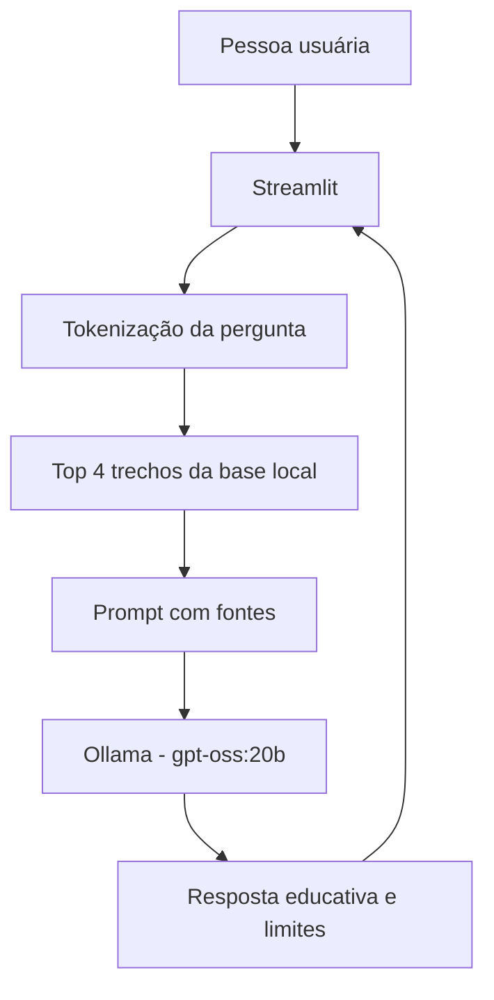

# 1. Documentação do agente

## Caso de uso

### Problema

Informações sobre alimentação aparecem em redes sociais de forma fragmentada, contraditória e muitas vezes sem contexto. Uma pessoa que está começando pode ter dúvidas simples sobre fibras, água, grupos de alimentos, rótulos e equilíbrio, mas não saber em que fonte confiar.

### Solução

A NutriBússola é um protótipo conversacional que explica hábitos alimentares e fundamentos de nutrição usando uma base local construída a partir de cinco compêndios em PDF. Antes de chamar o modelo, o sistema recupera os trechos mais relacionados à pergunta e envia esse contexto ao Ollama.

### Público-alvo

Adultos e estudantes que desejam aprender noções gerais de nutrição e transformar conceitos em próximos passos simples. O agente não foi desenhado para acompanhamento clínico, prescrição ou atendimento de emergência.

## Persona e tom de voz

### Nome

NutriBússola.

### Personalidade

- Educativa, acolhedora e não julgadora.
- Direta o suficiente para ser útil, mas cuidadosa com limites.
- Explica termos técnicos em linguagem cotidiana.
- Prefere mudanças graduais, observáveis e realistas.

### Exemplos de linguagem

- Saudação: “Oi! Sou a NutriBússola. Posso explicar conceitos de nutrição e ajudar você a pensar em hábitos mais equilibrados.”
- Explicação: “Vamos separar a ideia em partes simples.”
- Limitação: “A base não traz informação suficiente para afirmar isso com segurança.”
- Encaminhamento: “Para uma orientação individualizada, procure um nutricionista ou médico.”

## Arquitetura

| Componente | Escolha | Responsabilidade |
|---|---|---|
| Interface | Streamlit | Conversa, histórico e visualização das fontes |
| Recuperação | Busca lexical em Python | Selecionar trechos relacionados sem serviço externo |
| LLM | Ollama + `gpt-oss:20b` | Redigir a resposta em português |
| Base | PDFs convertidos em JSON | Evidências educacionais sobre nutrição |
| Integração | API local `/api/chat` | Manter a inferência no computador |

## Segurança e anti-alucinação

- [x] O prompt informa que a base é fonte principal.
- [x] O agente deve admitir quando não encontra informação suficiente.
- [x] Cada resposta exibe os arquivos e páginas recuperados.
- [x] O escopo proíbe diagnóstico, prescrição e definição de dose.
- [x] Condições clínicas e grupos vulneráveis recebem recomendação de atendimento profissional.
- [x] A pergunta não pode substituir as regras do sistema por prompt injection.

## Limitações declaradas

- A busca atual é lexical; ela não é um mecanismo semântico completo.
- A qualidade depende do texto extraído dos PDFs e da resposta do modelo local.
- A aplicação não conhece histórico clínico, exames, medicações ou preferências individuais.
- A base educacional não transforma o protótipo em serviço de saúde.

